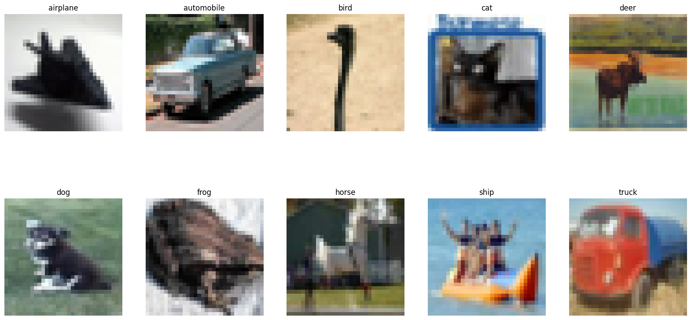
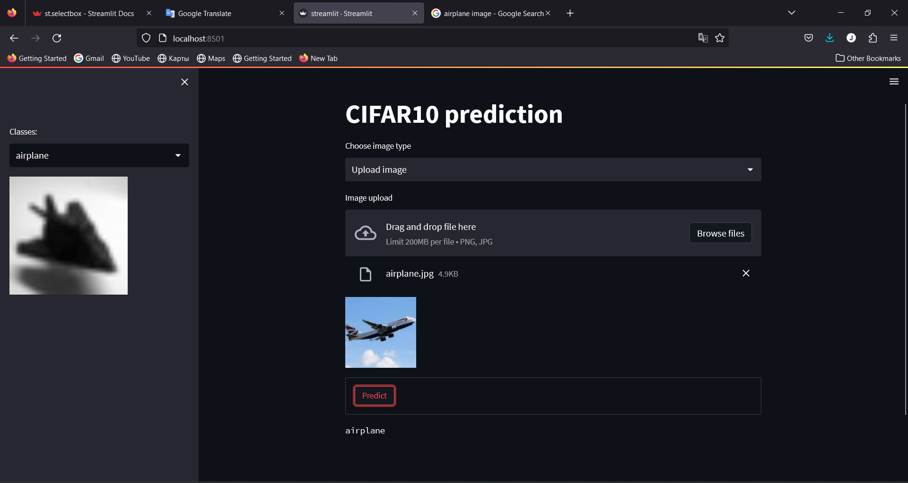

# cifar10

Loads the CIFAR10 dataset.

This is a dataset of 50,000 32x32 color training images and 10,000 test images, labeled over 10 categories. See more info at the CIFAR homepage.

The classes are:

|Label |	 Description     |
| ---- | ------------------- |
|0 	   |  airplane           |
|1 	   |  automobile         |
|2 	   |  bird               |
|3 	   |  cat                |
|4 	   |  deer               |
|5 	   |  dog                |
|6 	   |  frog               |
|7 	   |  horse              |
|8 	   |  ship               |
|9 	   |  truck              |

[Streamlit](https://freckledme-cifar10-streamlit-7fpz30.streamlit.app/)

Use

    pip install -r requirements.txt

